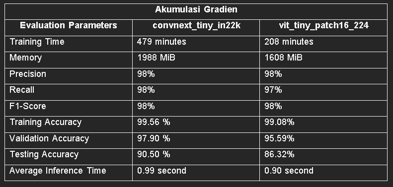

# model_uas_sispak_kelompok1

The purpose of this project is to train and then evaluate the training and inference performance of convnext_tiny_in22k model and vit_tiny_patch16_224 model without and when using gradient accumulation. The training performance of each model is measured by how much memory & training time it requires to train each model. Whereas the inference performance of each model is measured by how accurate each model is and average inference time of each model. After models evaluation we deployed the best model into website and android app. 

The training code is run in Python 3.8.1 environment and use CUDA 11.2 and cuDNN 8 for training with NVIDIA GPU. As for the library needed to train and make inference with the models is already provided in requirements.txt file. As for the web and app code is in different repositories. Both repository is provided in Additional Links Section. 

# Additional Links
As for the link to the thesis can be accessed through this google drive link: https://docs.google.com/document/d/15_weDW7YRxqqWNYI934LU81IgoNB_el9/edit?usp=sharing&ouid=109370577966711764027&rtpof=true&sd=true  
Link to dataset the is used in this project: https://www.kaggle.com/competitions/paddy-disease-classification/data  
Link to the android app: https://github.com/ProjectRips/padex-android-app.git  
Link to the website: https://github.com/ProjectRips/paddydiseaseclassifyapp.git  

# Result

 
 
